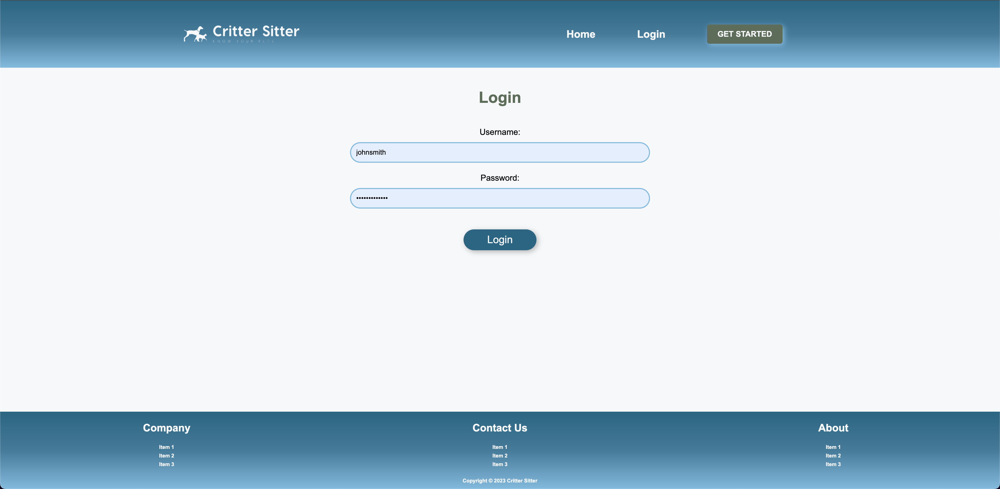

# critter-sitter

## Link to Deployed Application

<a href="https://desolate-cliffs-01368-b072fa39f7d0.herokuapp.com/">Critter-Sitter</a>

## Description
- Every animal is unique, and so are their needs.
- Critter Sitter bridges the information gap, ensuring that pet sitters have the right data at their fingertips. Say goodbye to mismanagement and mistakes, and say hello to efficient and safe pet care.
- Critter Sitter is a website that provides an organized and easily accessible database holding essential information about animals under a pet sitter's care. 
- With individualized details about each pet, from care level to detailed descriptions such as dietary restrictions and walk schedules, pet sitters can now provide a high level of care and attention to their furry clients.

## Usage
- Dashboard Overview: Upon logging into Critter Sitter, users are presented with a dashboard displaying a list of all pets under their care. Each pet entry includes a photo, name, and a brief description.
- Selecting a Pet: To delve into the specifics of a particular pet, the user can click on the pet's name or thumbnail. This will redirect the user to a detailed page dedicated to that specific pet.
- Viewing Detailed Information: Users will find comprehensive information about the pet, including its name, owner, address, carelevel, and a detailed description of the specific pet. This detailed description offers insights into the pet's temperament, special needs, allergies, health risks, walk schedules, etc.
- Editing and Updating Pet Information: Pet sitters can update any information as needed. To do this, the user can click on the "Edit" button found on the pet's individual page and update any fields as necessary and click "Save Changes" to confirm. If the pet is no longer under the sitter's care, they can select the "Delete" option.
- Adding a New Pet: On the dashboard, rhe user can click on the "+" button. Fill in all the required fields, including uploading a picture of the pet. Once all the information is filled in, click on the "Save Pet" button to add the pet to the database.
- Logging Out: Users can click on the "Logout" icon to securely exit the platform.
By following these steps, pet sitters can ensure that they are always informed and prepared to provide the best care possible for each unique pet.

## Screenshot of the Website

## Technologies Used
- Express.js: A web application framework for creating server-side applications.
- MySQL2: A relational database management system.
- Sequelize: A promise-based Node.js ORM for MySQL
- Bcrypt: For hashing passwords and ensuring data security.
- Express-session: For managing user sessions.
- Connect-session-sequelize: To store session data with Sequelize.
- Express-handlebars: A templating engine to render dynamic views.
- Multer: A middleware for handling multipart/form-data, primarily used for uploading files.
- Dotenv: A module for loading environment variables from a .env file.

## Installation
- Clone the Repository: Use the command 'git clone' to clone the Critter Sitter repository to your local machine.
- Navigate to the Project Directory: Change your current working directory to the cloned repository.
- Install Dependencies: Run 'npm install' to install all required dependencies for the project.
- Set Up Environment Variables: Rename '.env.example' to '.env' and fill out the necessary configurations such as the database credentials.
- Configure the Database Using MySQL: Ensure that you have MySQL set up on your local machine or use a remote MySQL provider. Use the provided schema in the db folder to set up your database.
- Heroku Deployment: Create a new Heroku application using heroku create. Push your local repository to Heroku using git push heroku main or git push heroku master depending on your default branch name. Ensure environment variables on Heroku are set.
- Access the Application: Open the deployed application in a browser using the link provided by Heroku or by running the command heroku open.

## Contribution

N/A

## Tests

N/A

## License

This project is covered under the [MIT](https://opensource.org/licenses/MIT) license.

## Questions

For any questions, please reach out to me at the following:

- [GitHub Profile](https://github.com/Team-1-UofT-Project2/critter-sitter)
- Email: 